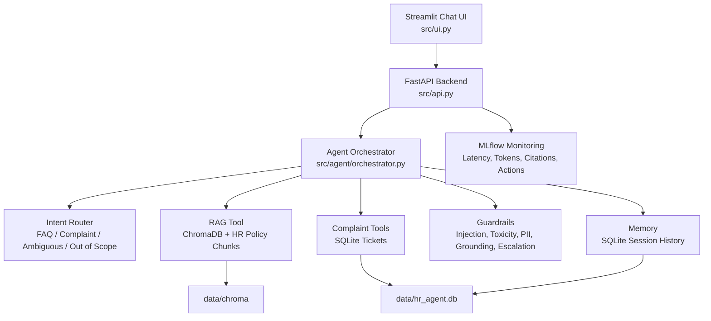

# HR FAQ & Complaint Chatbot

STAI100 Midterm Capstone project: an agentic HR assistant that answers HR policy questions with grounded RAG citations and supports complaint intake through a ReAct tool-calling workflow.

## Project Overview

The system supports two main workflows:

- **HR FAQ answering:** retrieves relevant HR policy chunks from ChromaDB and answers only when the response can be grounded with citations.
- **Complaint intake:** collects complaint details, validates them with structured schemas, files a SQLite-backed ticket, and escalates sensitive cases to HR using deterministic guardrail rules.

Core technologies:

- **LLM:** Google Gemini via `google-genai` by default, with optional Ollama support.
- **Embeddings:** Gemini embeddings by default, with optional Ollama embeddings.
- **Vector store:** ChromaDB.
- **Structured data:** SQLite.
- **API:** FastAPI.
- **UI:** Streamlit.
- **Monitoring:** MLflow.
- **Deployment:** Docker Compose.

## Architecture Diagram



## Setup Instructions

### 1. Create Environment File

Copy the example environment file:

```bash
cp .env.example .env
```

On Windows Command Prompt:

```bat
copy .env.example .env
```

Then add the required keys in `.env`:

```env
GEMINI_API_KEY=your_gemini_key_here
TAVILY_API_KEY=your_tavily_key_here
```

### 2. Run With Docker Compose

Start Docker Desktop first, then run:

```bash
docker compose up --build
```

Open the app:

- Streamlit UI: http://localhost:8501
- FastAPI health check: http://localhost:8000/health
- MLflow dashboard: http://localhost:5000

Stop the app with `Ctrl+C`, then:

```bash
docker compose down
```

### 3. Run Locally Without Docker

Install dependencies:

```bash
pip install -r requirements.txt
```

Build the knowledge base:

```bash
python scripts/ingest.py
```

Start the API:

```bash
uvicorn src.api:app --reload
```

In another terminal, start the UI:

```bash
streamlit run src/ui.py
```

### 4. Useful Checks

Run tests:

```bash
pytest tests/
```

Run retrieval evaluation:

```bash
python evals/run_retrieval_eval.py
```

Run guardrail evaluation:

```bash
python evals/run_guardrail_eval.py
```

Run escalation evaluation:

```bash
python evals/run_escalation_eval.py
```

## Module Ownership

| Member | Modules | Code |
| --- | --- | --- |
| Baybayon | RAG + data pipeline, Structured Outputs | `scripts/ingest.py`, `src/rag/`, `src/schemas.py`, `data/raw/`, `evals/` |
| Del Rosario | ReAct Agent, Tool Use, Disambiguation, LLM/embedding provider abstraction | `src/agent/orchestrator.py`, `src/agent/router.py`, `src/agent/tools.py`, `src/agent/usage.py`, `src/agent/llm_client.py` |
| Burayag | Guardrails, Memory, Prompt Engineering | `src/guardrails/`, `src/memory/`, `src/agent/prompts.py` |
| Tamondong | Chat UI, API Endpoint, MLflow, Docker | `src/ui.py`, `src/api.py`, `src/monitoring.py`, `Dockerfile*`, `docker-compose.yml` |
