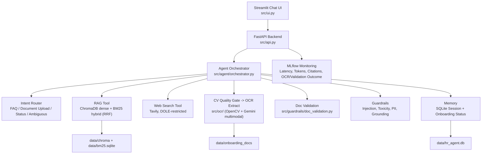

# Onboarding Concierge — STAI100 Final Capstone

An agentic system that answers new-hire onboarding FAQs via RAG (with verified citations) and, for the Final, verifies onboarding documents (NBI clearance, SSS, Pag-IBIG, BIR, PhilHealth, APE) through an OCR/CV extraction tool validated against deterministic checklist rules. Pivoted from the Midterm's "HR FAQ & Complaint Chatbot" — the RAG pipeline, agent orchestrator, guardrails, memory, and API/UI/MLflow/Docker scaffolding are all reused. Complaint intake and escalation have been **removed** from the codebase (see [PLAN.md](PLAN.md) §1.3) in favor of the onboarding-document-verification direction.

See [PLAN.md](PLAN.md) for the full architecture, RRL, and component ownership, and the `[Stratpoint x DLSU] Final Capstone - Project Specification.txt` in the repo root for the course requirements (supersedes [specs.md](specs.md), the Midterm spec, kept for reference).

## Project Overview

The system supports one workflow today, with a second planned for the Final:

- **Onboarding/HR FAQ answering:** retrieves relevant HR policy chunks from ChromaDB (dense + BM25 hybrid, see PLAN.md §3.4) and answers only when the response can be grounded with citations, with a DOLE/labor-law web-search fallback.
- **Onboarding document verification** (new for the Final, planned): a deterministic OpenCV quality gate, Gemini multimodal field extraction, and deterministic checklist validation — see PLAN.md §4.1–§4.4, §5.

Core technologies:

- **LLM:** Google Gemini via `google-genai` by default, with optional Ollama support (`LLM_PROVIDER`).
- **Embeddings:** Gemini embeddings by default, with optional Ollama embeddings (`EMBEDDING_PROVIDER`).
- **Vector store:** ChromaDB.
- **Structured data:** SQLite.
- **API:** FastAPI.
- **UI:** Streamlit.
- **Monitoring:** MLflow.
- **Deployment:** Docker Compose.

## Architecture Diagram


```mermaid
flowchart TD
    UI["Streamlit Chat UI<br/>src/ui.py"] --> API["FastAPI Backend<br/>src/api.py"]
    API --> Agent["Agent Orchestrator<br/>src/agent/orchestrator.py"]
    Agent --> Router["Intent Router<br/>FAQ / Document Upload / Status / Ambiguous"]
    Agent --> RAG["RAG Tool<br/>ChromaDB dense + BM25 hybrid (RRF)"]
    Agent --> Web["Web Search Tool<br/>Tavily, DOLE-restricted"]
    Agent --> CV["CV Quality Gate -> OCR Extract<br/>src/ocr/ (OpenCV + Gemini multimodal)"]
    Agent --> Validate["Doc Validation<br/>src/guardrails/doc_validation.py"]
    Agent --> Guardrails["Guardrails<br/>Injection, Toxicity, PII, Grounding"]
    Agent --> Memory["Memory<br/>SQLite Session + Onboarding Status"]
    API --> MLflow["MLflow Monitoring<br/>Latency, Tokens, Citations, OCR/Validation Outcome"]
    RAG --> Chroma["data/chroma + data/bm25.sqlite"]
    CV --> OnboardingDocs["data/onboarding_docs"]
    Memory --> SQLite["data/hr_agent.db"]
```

*Planned, not yet implemented — see [PLAN.md](PLAN.md) §2, §4.2–§4.4 for the target design: `src/ocr/`, `src/guardrails/doc_validation.py`, `src/rag/hybrid.py`, `POST /upload-doc`, `GET /onboarding-status/{id}`.*

## Setup Instructions

### 1. Create Environment File

Copy the example environment file:

```bash
cp .env.example .env
```

On Windows Command Prompt:

```bat
copy .env.example .env
```

Then add the required keys in `.env`:

```env
GEMINI_API_KEY=your_gemini_key_here
TAVILY_API_KEY=your_tavily_key_here
```

### 2. Run With Docker Compose

Start Docker Desktop first, then run:

```bash
docker compose up --build
```

Open the app:

- Streamlit UI: http://localhost:8501
- FastAPI health check: http://localhost:8000/health
- MLflow dashboard: http://localhost:5000

Stop the app with `Ctrl+C`, then:

```bash
docker compose down
```

### 3. Run Locally Without Docker

Install dependencies:

```bash
pip install -r requirements.txt
```

Build the knowledge base:

```bash
python scripts/ingest.py
```

Start the API:

```bash
uvicorn src.api:app --reload
```

In another terminal, start the UI:

```bash
streamlit run src/ui.py
```

## API Reference

`src/api.py` exposes:

- `POST /chat` — `session_id` + `message` → `reply`, verified `citations`, retrieved `sources`, workflow `actions`, `token_usage`.
- `GET /usage` — today's + all-time agent token/request usage per model.
- `GET /health` — demo readiness check: Chroma index, manifest, API key config, MLflow URI.
- `POST /upload-doc` — **planned, not yet implemented**: OCR document submission for the Final (see PLAN.md §4.4, §7/§8).
- `GET /onboarding-status/{employee_id}` — **planned, not yet implemented**: per-employee checklist state (see PLAN.md §4.3–§4.4).

`src.monitoring.chat_trace()` logs sanitized MLflow telemetry (latency, source/citation/action/token counts, route, request size) and never logs raw employee messages or model answers, since request text can contain PII.

## Useful Checks

Run tests:

```bash
pytest tests/
```

Run retrieval evaluation:

```bash
python evals/run_retrieval_eval.py
```

Run guardrail evaluation:

```bash
python evals/run_guardrail_eval.py
```

*(OCR/document-validation evals are planned for the Final — `run_ocr_eval.py` / `run_validation_eval.py` / `run_answer_eval.py` don't exist yet; see PLAN.md §7, §9.)*

## Component Ownership

Maps to the Final spec's 14-component checklist (see [PLAN.md](PLAN.md) §4 for full detail, build status, and what's reused vs. new).

| Member | Components | Code |
| --- | --- | --- |
| Baybayon | RAG, Advanced RAG, Evals | `scripts/ingest.py`, `src/rag/` (incl. planned `hybrid.py`), `data/raw/`, `evals/` |
| Del Rosario | ReAct/Tool Use, Disambiguation, LLM/embedding provider abstraction | `src/agent/orchestrator.py`, `src/agent/router.py`, `src/agent/tools.py`, `src/agent/usage.py`, `src/agent/llm_client.py` |
| Burayag | Memory, Guardrails | `src/guardrails/` (incl. planned `doc_validation.py`), `src/memory/` (incl. planned `onboarding_status.py`) |
| Tamondong | Chat UI, API Endpoint, LLMOps | `src/ui.py`, `src/api.py`, `src/monitoring.py`, `Dockerfile*`, `docker-compose.yml` |
| **Team (shared)** | **CV/DS Domain Integration (mandatory)** — OCR document extraction | `src/ocr/` (planned) |

Pipeline, chunking, retrieval, and schema detail for the RAG/Evals components is documented in [PLAN.md](PLAN.md) §3 rather than duplicated here.
