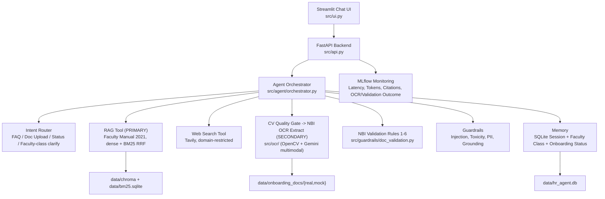

# Faculty Onboarding Concierge — STAI100 Final Capstone

An agentic system that answers **faculty onboarding and Faculty Manual questions** via RAG (with page-level citations) over the real **De La Salle University Faculty Manual 2021 (203 pages)**, and — as a secondary track — verifies a submitted **NBI Clearance** through an OCR/VLM extraction tool validated against deterministic rules.

Built for DLSU faculty because we have the real Manual; designed so another PH university's manual is a **data swap, not a code change**.

Pivoted from the Midterm's "HR FAQ & Complaint Chatbot" — the RAG pipeline, agent orchestrator, guardrails, memory, and API/UI/MLflow/Docker scaffolding are all reused. Complaint intake and escalation have been **removed** from the codebase (see [PLAN.md](PLAN.md) §1.5).

**Start here:** [SCOPE.md](SCOPE.md) for the plain-language problem statement and what's in/out of scope. [PLAN.md](PLAN.md) for architecture, corpus, evals, RRL, and build order. The `[Stratpoint x DLSU] Final Capstone - Project Specification.txt` in the repo root is the governing spec (supersedes [specs.md](specs.md), the Midterm spec, kept for reference).

## Problem Statement

A newly hired DLSU faculty member must satisfy a 203-page Faculty Manual and a stack of pre-employment paperwork before they can teach — and today both are handled by a human, one email and one eyeballed scan at a time.

- **Can an agent reliably answer Faculty Manual questions on three specific topics?** — **PRIMARY**, this is where the metrics live. Proof point: *can we reach ~100% eval accuracy on a handbook of ≥100 pages?*
- **Can it verify that a submitted NBI Clearance is complete and correct?** — **SECONDARY**, reported separately for **real** and **mock** document subsets.

### The three topics

| # | Topic | Manual sections |
|---|---|---|
| **T1** | **Pre-employment & hiring requirements for faculty** — original TOR & diplomas, biodata/CV, three references, teaching demonstration, clearance from previous employer and concerned government agency, physical-fitness certification, plus the national statutory set (NBI, SSS, PhilHealth, Pag-IBIG, BIR) | Hiring Procedure p.24; per-rank Criteria for Hiring pp.16–23 |
| **T2** | **Academic & grading obligations** — grade prerogative and the Change of Grade form, grade submission deadlines, syllabus within the first two weeks, exam-material handling, and the sanctions attached | General Functions §1.1 p.8; **Appendix F, Table of Offenses and Sanctions, p.135** |
| **T3** | **HR policies — dress code & leaves** | **Appendix D, p.131**; Benefits §8 Leaves pp.42–48 |

Two verified corpus gaps (statutory documents aren't in the Manual; several grading "don'ts" belong to the Student Handbook) and their resolutions are documented in [SCOPE.md](SCOPE.md) §2 and [PLAN.md](PLAN.md) §1.2 — read those before writing golden-set rows.

## Project Overview

- **Faculty Manual Q&A (primary):** retrieves chunks from ChromaDB (dense + BM25 hybrid, PLAN.md §3.4) and answers only when grounded, with page-level citations, a faculty-class clarifying question when full-time / part-time / ASF changes the answer, and an "I don't know" + routing fallback.
- **NBI Clearance verification (secondary, planned):** a deterministic OpenCV quality gate, one Gemini multimodal field extraction call, and deterministic validation rules — see PLAN.md §4.1–§4.2, §5.

Core technologies:

- **LLM:** Google Gemini via `google-genai` by default, optional Ollama (`LLM_PROVIDER`).
- **Embeddings:** Gemini by default, optional Ollama (`EMBEDDING_PROVIDER`).
- **Corpus:** `data/faculty-manual-2021.pdf` + a small supplementary statutory-requirements doc.
- **Vector store:** ChromaDB. **Structured data:** SQLite. **API:** FastAPI. **UI:** Streamlit. **Monitoring:** MLflow. **Deployment:** Docker Compose.

## Architecture Diagram


```mermaid
flowchart TD
    UI["Streamlit Chat UI<br/>src/ui.py"] --> API["FastAPI Backend<br/>src/api.py"]
    API --> Agent["Agent Orchestrator<br/>src/agent/orchestrator.py"]
    Agent --> Router["Intent Router<br/>FAQ / Doc Upload / Status / Faculty-class clarify"]
    Agent --> RAG["RAG Tool (PRIMARY)<br/>Faculty Manual 2021, dense + BM25 RRF"]
    Agent --> Web["Web Search Tool<br/>Tavily, domain-restricted"]
    Agent --> CV["CV Quality Gate -> NBI OCR Extract (SECONDARY)<br/>src/ocr/ (OpenCV + Gemini multimodal)"]
    Agent --> Validate["NBI Validation Rules 1-6<br/>src/guardrails/doc_validation.py"]
    Agent --> Guardrails["Guardrails<br/>Injection, Toxicity, PII, Grounding"]
    Agent --> Memory["Memory<br/>SQLite Session + Faculty Class + Onboarding Status"]
    API --> MLflow["MLflow Monitoring<br/>Latency, Tokens, Citations, OCR/Validation Outcome"]
    RAG --> Chroma["data/chroma + data/bm25.sqlite"]
    CV --> OnboardingDocs["data/onboarding_docs/{real,mock}"]
    Memory --> SQLite["data/hr_agent.db"]
```

*Planned, not yet implemented — see [PLAN.md](PLAN.md) §2, §4.2–§4.4: `src/ocr/`, `src/guardrails/doc_validation.py`, `src/rag/hybrid.py`, `POST /upload-doc`, `GET /onboarding-status/{id}`.*

## Handling Real Documents

The OCR eval uses two separate subsets, **real** and **mock**, reported as separate numbers and never pooled. Real NBI Clearances are collected only with recorded consent; `data/onboarding_docs/real/` is **gitignored and never committed**; names and reference numbers are hashed anywhere they leave the machine; EXIF is stripped on upload; and **no real document appears in a slide, screenshot, or recorded demo** — demos use mock documents only. Full rules: [SCOPE.md](SCOPE.md) §8, [PLAN.md](PLAN.md) §3.5.

## Setup Instructions

### 1. Create Environment File

```bash
cp .env.example .env
```

On Windows Command Prompt:

```bat
copy .env.example .env
```

Then add the required keys in `.env`:

```env
GEMINI_API_KEY=your_gemini_key_here
TAVILY_API_KEY=your_tavily_key_here
```

### 2. Run With Docker Compose

Start Docker Desktop first, then:

```bash
docker compose up --build
```

- Streamlit UI: http://localhost:8501
- FastAPI health check: http://localhost:8000/health
- MLflow dashboard: http://localhost:5000

Stop with `Ctrl+C`, then `docker compose down`.

### 3. Run Locally Without Docker

```bash
pip install -r requirements.txt
python scripts/ingest.py            # ingests data/faculty-manual-2021.pdf + data/raw/
uvicorn src.api:app --reload
streamlit run src/ui.py             # in another terminal
```

Note: don't mix host and Docker ingestion against the same `data/chroma/` — chromadb's cross-platform index format will panic on open. Pick one environment per index (PLAN.md §10).

## API Reference

`src/api.py` exposes:

- `POST /chat` — `session_id` + `message` → `reply`, verified `citations` (with page numbers), retrieved `sources`, workflow `actions`, `token_usage`.
- `GET /usage` — today's + all-time agent token/request usage per model.
- `GET /health` — demo readiness: Chroma index, manifest, API key config, MLflow URI.
- `POST /upload-doc` — **planned**: NBI Clearance submission (PLAN.md §4.4).
- `GET /onboarding-status/{employee_id}` — **planned**: per-hire checklist state (PLAN.md §4.3–§4.4).

`src.monitoring.chat_trace()` logs sanitized MLflow telemetry (latency, source/citation/action/token counts, route, request size) via fail-closed allowlists, and never logs raw messages, model answers, or extracted document field values.

## Useful Checks

```bash
pytest tests/
python evals/run_retrieval_eval.py   # per-topic + per-tier hit-rate on the golden set
python evals/run_guardrail_eval.py
```

*(OCR/document-validation evals are planned — `run_ocr_eval.py` / `run_validation_eval.py` / `run_answer_eval.py` don't exist yet; see PLAN.md §7, §9.)*

## Component Ownership

Maps to the Final spec's 14-component checklist (see [PLAN.md](PLAN.md) §4 for full detail, build status, and what's reused vs. new).

| Member | Components | Code |
| --- | --- | --- |
| Baybayon | RAG, Guardrails, ReAct tools (web search, calling the CV integration) | `scripts/ingest.py`, `src/rag/` (incl. planned `hybrid.py`), `src/guardrails/`, `src/agent/tools.py` |
| Del Rosario | CV integration and its evaluation | `src/ocr/` (planned), `evals/run_ocr_eval.py` (planned) |
| Burayag | RRL, end-to-end evals | [PLAN.md](PLAN.md) §5, `evals/run_answer_eval.py` / `run_validation_eval.py` (planned) |
| Tamondong | Evals dataset, Chat UI, API endpoint, LLMOps | `evals/golden_set.jsonl`, `src/ui.py`, `src/api.py`, `src/monitoring.py`, `Dockerfile*`, `docker-compose.yml` |
| **Team (shared)** | **CV/DS Domain Integration (mandatory, Component 14)** | `src/ocr/` (planned) |

Pipeline, chunking, retrieval, and eval-set detail is documented in [PLAN.md](PLAN.md) §3 rather than duplicated here.

## Source Acknowledgement

`data/faculty-manual-2021.pdf` is the **De La Salle University Faculty Manual 2021**, reproduced for non-commercial academic use with DLSU acknowledged as source, per the notice on its own copyright page. Do not redistribute it outside this course context.
